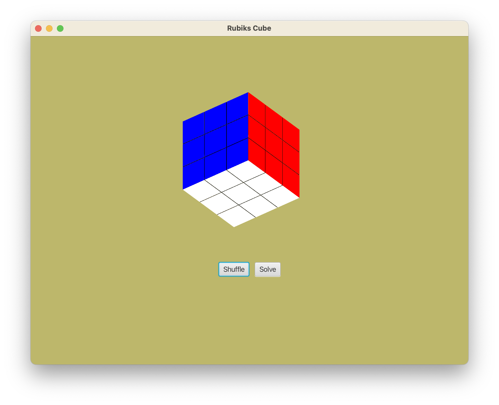

# Interactive Rubik's Cube 

A fun little project that creates a Rubik's cube using JavaFX. The Rubik's Cube can be interacted with, shuffled, and solved. 

*Do Note that the program doesn't intelligently solve the rubik's cube. It is just storing the transformations performed on the cube and then re-performing them in reverse. In future I plan to change this to a uniform cost search with some heuristics to actually 'solve' the cube* 

## How to Use

Drag the mouse around the screen to rotate the view of the cube. 

Each face can be rotated clockwise by pressing the key on the keyboard corresponding to the color of face. E.g. Pressing b rotates the blue face clockwise. 

For counter clockwise rotations press the key immediately to the right of the clockwise key. E.g. pressing N rotates the blue face counterclockwise. 

*Do note that I haven't implemented the middle face M rotation yet*

The 'Shuffle' and 'Solve Buttons' can be switched between by pressing the arrow keys. Press Space to execute the button. 

## Install

#### Mac OS 

 **[Rubiks App-1.0.dmg](assets/Rubiks_App-1.0.dmg)** 

***There will be a warning on installation*** *because I havent had the program notarized and signed by apple. Unless you want to fiddle around with security settings I recommend just downloading the .jar file found below*

 

#### Windows 

to be done 

#### Linux 

to be done 

#### .jar file 

**[Rubiks App.jar](assets/Rubiks.jar)**

*Do note that this requires the [Java Development Kit](https://www.oracle.com/uk/java/technologies/downloads/) be installed* 

